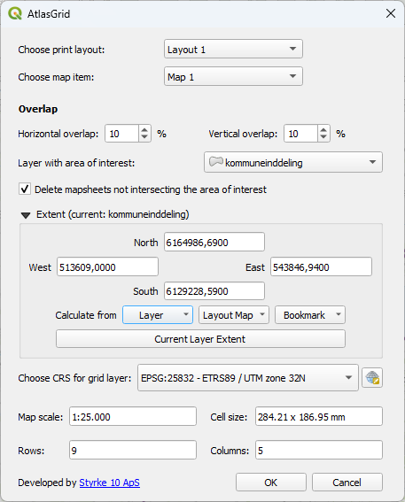
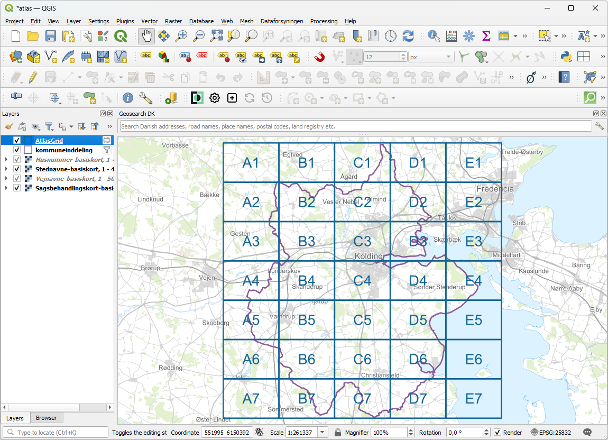
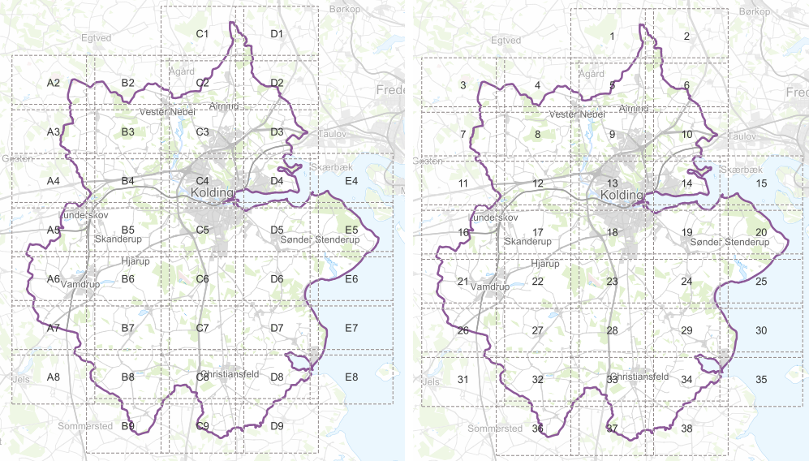
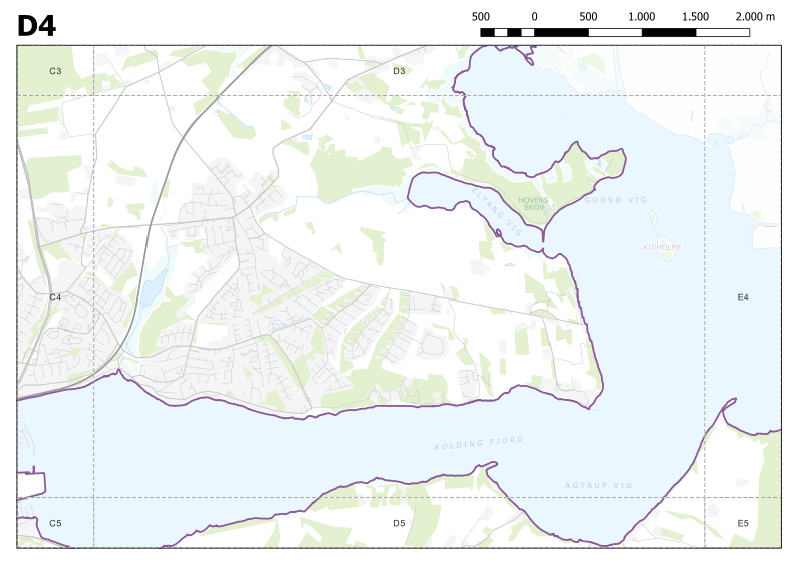
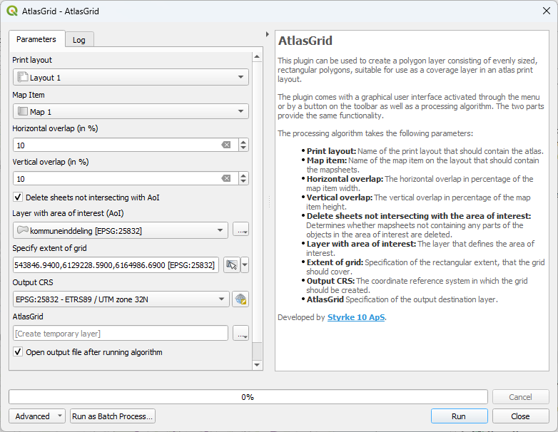

# AtlasGrid v. 2.x

## Purpose

This plugin allows you to create a polygon layer consisting of evenly sized, rectangular polygons, suitable for use as a coverage layer in an atlas print layout.

## Background

Consider a map like the one shown below. You want to make an atlas plot, that divides the municipality polygon into rows and columns of mapsheets in a scale of 1:25.000. Additionally, you want the map sheets to overlap each other by 10% horizontally and vertically.

To do this, you need a polygon layer with rectangular polygons sized to match the map item on your print layout at the specified map scale. Manually calculating the real-world size of these rectangles—especially with overlap—and creating the necessary number of them to cover the area is quite a tedious task.

## Using the plugin

With the plugin, all calculations and polygon creation are handled automatically.

As shown in the illustration below, when you activate the plugin, a dialog appears where you can select the print layout and the map item that should display your map sheets. You can also specify an overlap if desired. 

If you only want to create map sheets that cover a specific area of interest (and not the entire rectangular extent), you choose the layer containing your AoI and check the **Delete** checkbox.

Next, you choose the extent of your atlas or map book - either by inputting coordinates manually or (probably more common) by selecting an existing layer as the extent. Finally, you specify the output CRS for the layer being created.

At the bottom of the dialog the plugin displays the map scale and cell size of your map item (retrieved from your layout), along with the resulting number of rows and columns of map sheets.

## The result

Once all parameters have been set, and you click **OK**, the plugin creates a polygon layer consisting of the required rectangles in the appropriate size, number and optionally overlap. It also adds an attribute to the layer containing a cell name: columns are named with letters (A-Z) and rows with numbers. The northwestermost rectangle is labeled 'A1', its neighbour to the east 'B1' and to the south 'A2'.

An example is  shown below:

Furthermore - if you prefer sequentially numbered mapsheets - an attribute with the mapsheet number will be calculated alongside the cellname. Below you can see the cell names on the left and the cell numbers on the right.

Cells are numbered from west to east starting with the northernmost row of cells and continuing southward.

## Plotting an atlas

Now you are ready to complete your atlas setup. The steps above require at least a layout with a map item having already been created. All that remains is to set the newly generated grid as the coverage layer for your atlas and enable the atlas preview.

**Important:** If you have created a grid with overlapping map sheets, do **not** set an overlap in the map item properties! The grid already accounts for this, so the overlap should be set to 0%.

# The processing algorithm

All the funtionality described above is also contained in the plugin as a processing algorithm, allowing you to incorporate the functionality in a QGIS model.

Find it in your Processing Toolbox under **'AtlasGrid'**.
