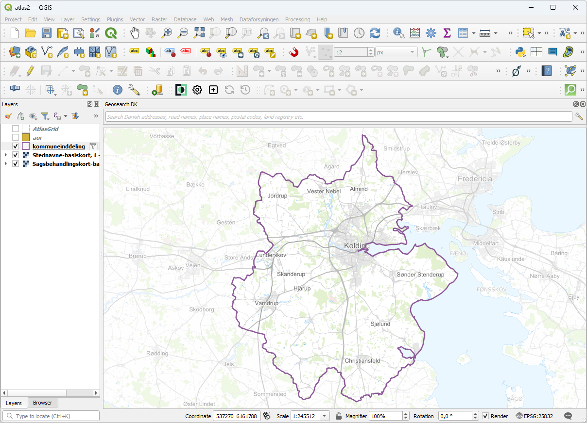

# AtlasGrid
## Purpose

This plugin can be used to create a polygon layer consisting of even-sized, rectangular polygons, that is suited for use as a coverage layer in an atlas plot layout.

## Use
<.....>

### Sub
<.....>

