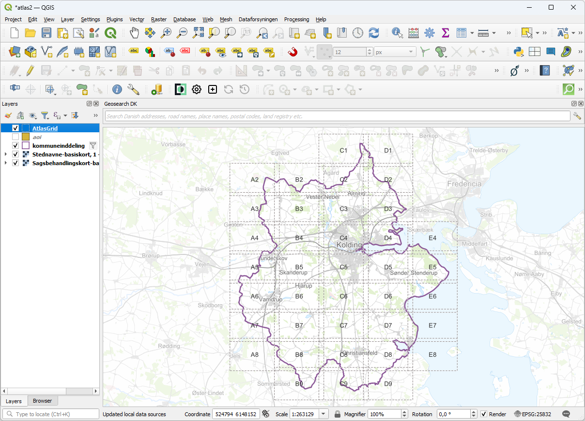

# AtlasGrid
## Purpose

This plugin can be used to create a polygon layer consisting of evenly sized, rectangular polygons, that is suited for use as a coverage layer in an atlas print layout.

## Background
Consider a map like the one shown below. You want to make an atlas plot, that divides the municipality polygon into rows and columns of mapsheets in a scale of 1:25.000.

For this purpose you need a polygon layer with rectangular polygons in a size that matches the map item on your print layout at the given map scale. To achieve this manually you would have to calculate the real world size of your rectangles, and then create the number of rectangles necessary to cover the area - a quite tedious task! 

## With the plugin
Using the plugin all these calculations and the creation of polygons will be achieved automatically.

As shown in the illustration below, when you activate the plugin a dialog is shown, where you pick the print layout and the map item that should display your mapsheets. Further more you choose the extent of your atlas or map book, either by inputting coordinates manually or (probably more often) by selecting an existing layer as the extent.

The plugin will show the resulting number of rows and columns of mapsheets, when everything has been picked.

## The result
When the parameters have been set, and you press the OK button, the plugin will create a polygon layer consisting of the necessary rectangles in the appropriate size and number. It will furthermore add an attribute to the layer containing a cell name, so that columns are named with letters (A-Z) and row are named with numbers. The most northwesterly placed rectangle will be 'A1', its neighbour to the east 'B1' and to the south 'A2'.

An example is  shown below:

